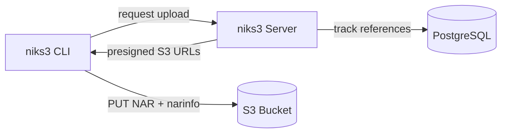
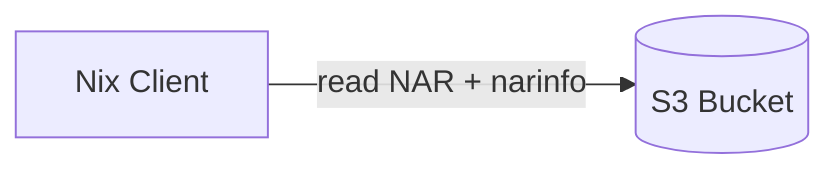
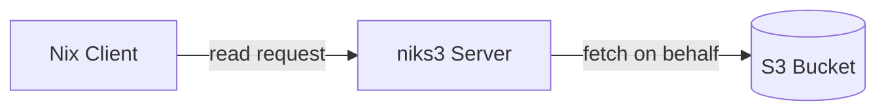
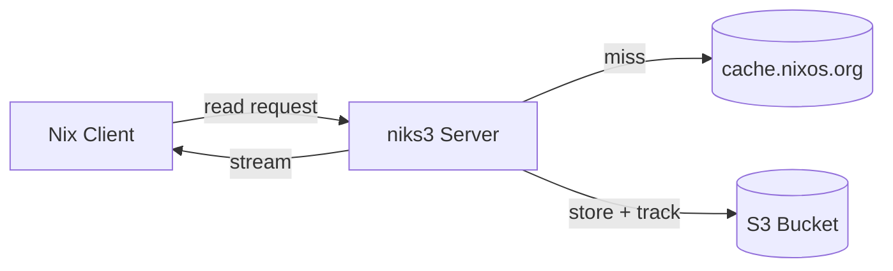

  

# S3-backed Nix binary cache with garbage collection

The idea is to have all reads be handled by the s3 cache (which itself can be high-available)
and have a gc server that tracks all uploads to the cache and runs periodic garbage collection on s3 cache.
Since writes to a binary cache are often not as critical as reads,
we can vastly simplify the operational complexity of the GC server, i.e. only
running one instance next to the CI infrastructure.

## Architecture

### Write path

The niks3 CLI requests an upload from the server, which returns pre-signed S3 URLs.
The client uploads NAR files and narinfo directly to S3.
The server tracks references in PostgreSQL for garbage collection.

### Read path

Nix clients read directly from S3 (or a CDN in front of it) without going through niks3.
This allows the read path to scale independently and remain highly available.

### Read proxy (optional)

For private S3 buckets, niks3 can proxy read requests
from Nix clients to S3 using its own credentials. Enable with `--enable-read-proxy`.
See the [Private S3 Buckets](https://github.com/Mic92/niks3/wiki/Private-S3-Buckets) wiki page.

With `--read-redirect-ttl 15m` NAR requests are answered with a 307 to a
presigned S3 URL instead of being streamed, so NAR bytes bypass niks3. Narinfos
and other metadata stay proxied. Note that anyone holding such a URL can fetch
that object until it expires, regardless of read-proxy authentication.

### Pull-through (optional)

With `--pull-through-upstream https://cache.nixos.org` the read proxy behaves
like [nixos-passthru-cache](https://github.com/numtide/nixos-passthru-cache):
a narinfo or NAR the bucket lacks is fetched from the upstream, streamed to
the client and stored in the bucket, so the next reader is served from S3.
Only narinfos and NARs are filled; listings, logs and realisations still 404.

- Upstream narinfos are stored byte for byte, so their signatures stay valid.
  niks3 does not re-sign them. Clients keep the upstream's key in
  `trusted-public-keys` alongside niks3's own.
- `--trusted-key cache.nixos.org-1:...` refuses to serve or store
  narinfos that no listed key signed. The public keys of `--sign-key-path`
  are always in the list, so pull-through needs one or the other. NARs are
  checked against the `FileHash` from their narinfo before they become
  visible; what each narinfo said about its NAR is kept in the database, so
  the check survives restarts. A NAR whose narinfo niks3 has not seen is
  streamed to the client but not stored.
- Pulled narinfos are tracked as *pull-through closures* that record the
  trusted signature they were verified with. They age and expire under the
  same GC `--older-than` as uploaded closures; reads do not refresh either.
- Upstream 404s are remembered for `--pull-through-negative-ttl` (default 1m).
  Responses carry `X-Cache-Status: HIT`, `MISS` or `NEGATIVE`.
- `--pull-through-concurrency` (default 16) bounds NAR fills, each of which may
  buffer a 16 MiB multipart part. The cheap narinfo fills are bounded separately
  by `--pull-through-narinfo-concurrency` (default 256), so a nixpkgs bump does
  not queue behind large NARs.

If clients list both caches as substituters, keep niks3's `--cache-priority`
below cache.nixos.org's 40 (the default is 30), or Nix never asks niks3 first.

## Features

### Binary Cache Protocol Support

niks3 implements the [Nix binary cache specification](https://nixos.org/manual/nix/stable/command-ref/new-cli/nix3-help-stores.html#s3-binary-cache-store) with the following features:

- **Cryptographic signing**: NAR signatures using Ed25519 keys (compatible with `nix key generate-secret`)
- **NAR files** (`nar/`): Compressed with zstd, stored in S3
- **Narinfo files** (`.narinfo`): Metadata with cryptographic signatures
  - StorePath, URL, Compression, NarHash, NarSize
  - References, Deriver
  - Signatures (Sig fields)
  - CA field for content-addressed derivations
- **Build logs** (`log/`): Compressed build output storage
- **Realisation files** (`realisations/*.doi`): For content-addressed derivations
- **Cache info** (`nix-cache-info`): Automatic generation with WantMassQuery, Priority

### Advanced Features

- **Multipart uploads**: Efficient handling of large NARs (>100MB)
- **Transactional uploads**: Atomic closure uploads with rollback on failure
- **Garbage collection**: Reference-tracking GC with configurable retention
- **Parallel uploads**: Client parallelizes NAR and metadata uploads
- **[Streaming push](https://github.com/Mic92/niks3/wiki/Streaming-Push)**: `niks3 push --stdin` for long-running producers
- **[Build claims](https://github.com/Mic92/niks3/wiki/Build-Claims)**: build deduplication for several builders sharing the cache

### Operational Features

- Authentication via API tokens (Bearer auth)
- OIDC authentication for CI/CD systems (GitHub Actions, GitLab CI)
- S3 credentials via static keys (`--s3-access-key` / `--s3-secret-key`) or IAM (`--s3-use-iam` for IRSA, EC2 instance profiles, ECS task roles)
- [Automatic upload](https://github.com/Mic92/niks3/wiki/Auto-Upload) via post-build-hook with crash-safe SQLite queue

## Choosing an S3 Provider

niks3 works with any S3-compatible storage provider. We recommend **Cloudflare R2** for most users due to zero egress fees and excellent performance.

For detailed pricing comparison and alternative providers, see the [S3 Provider Comparison](https://github.com/Mic92/niks3/wiki/S3-Provider-Comparison) wiki page.

## Setup

For complete setup instructions, see the [Setup Guide](https://github.com/Mic92/niks3/wiki/Setup-Guide) in the wiki.

## Kubernetes

Chart: `oci://ghcr.io/mic92/charts/niks3` (source in [`deploy/helm/niks3`](deploy/helm/niks3)), image: `ghcr.io/mic92/niks3`.
See the [Kubernetes](https://github.com/Mic92/niks3/wiki/Kubernetes) wiki page
for Postgres/S3 wiring and letting pods push via their service account token.

## OIDC Authentication (CI/CD)

niks3 supports OIDC authentication for CI/CD systems. See the wiki for details:

- [OIDC Configuration](https://github.com/Mic92/niks3/wiki/OIDC)
- [GitHub Actions](https://github.com/Mic92/niks3/wiki/GitHub-Actions)
- [GitLab CI](https://github.com/Mic92/niks3/wiki/GitLab-CI)

## Development

For development setup, database migrations, benchmarks, and contribution guidelines, see [CONTRIBUTING.md](CONTRIBUTING.md).

## Real-World Deployments

- **Clan infra**:
  [Configuration](https://git.clan.lol/clan/clan-infra/src/branch/main/modules/web01/niks3.nix)
  | [Instance](https://cache.clan.lol/)
- **Numtide**: [Instance](https://cache.numtide.com/)
- **TUM-DSE**:
  [Configuration](https://github.com/TUM-DSE/doctor-cluster-config)
  | [Instance](https://cache.dos.cit.tum.de/)

## Need commercial support or customization?

For commercial support, please contact [Mic92](https://github.com/Mic92/) at
joerg@thalheim.io or reach out to [Numtide](https://numtide.com/contact/).
